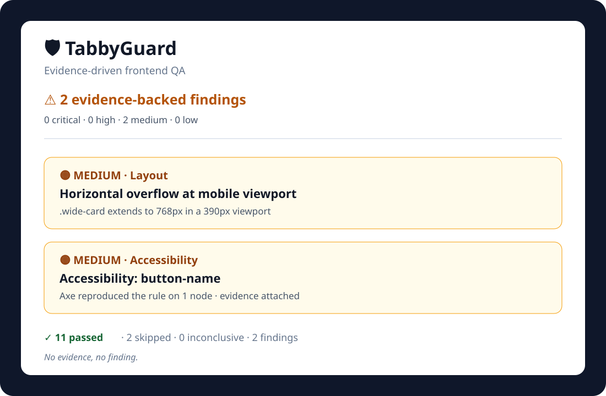
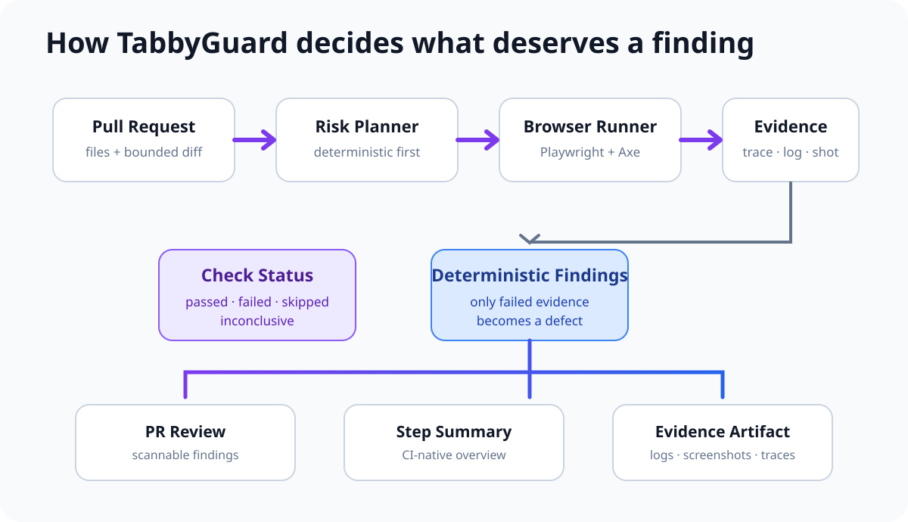

<div align="center">


<br />


<br />

**Change-aware browser QA that tests the deployed pull request, captures proof, and posts a focused review before merge.**

[Quick Start](#-quick-start) · [How It Works](#-how-it-works) · [Checks](#-what-tabbyguard-checks) · [Demo Fixtures](#-proof-oriented-demo-fixtures) · [Configuration](#%EF%B8%8F-configuration)

</div>

---

## 📌 Project Summary

**TabbyGuard** is a GitHub Action for frontend pull-request QA.

Static checks are essential, but they cannot tell you everything that happens in the running browser. A clean diff can still produce a mobile overflow bug, an inaccessible control, a runtime exception, a broken dialog, or a failed first-party request.

TabbyGuard closes that gap by combining pull-request change context with targeted browser checks.

It:

- Reads changed files and bounded diff context from the pull request
- Maps those changes to a small, high-signal test plan
- Opens the preview deployment in a real browser
- Runs runtime, network, accessibility, responsive-layout, interaction, and keyboard checks
- Distinguishes **passed**, **failed**, **skipped**, and **inconclusive** checks
- Captures screenshots, Playwright traces, logs, and accessibility JSON
- Posts a concise PR review and GitHub Step Summary
- Exposes outputs so the rest of CI can react programmatically
- Optionally uses OpenAI to refine planning and explain likely causes without giving the model authority to invent findings

The core rule is intentionally strict:

> **No evidence, no finding.**

---

## ✨ See the Review Format



The review is designed to answer four questions quickly:

1. **What failed?**
2. **Where did it fail?**
3. **What evidence was captured?**
4. **Which changed files are most likely related?**

A skipped heuristic never appears as a defect just because TabbyGuard could not find a safe element to test.

---

## 🚀 Quick Start

Add TabbyGuard after your preview deployment is available:

```yaml
name: Frontend QA

on:
  pull_request:

permissions:
  contents: read
  pull-requests: write

jobs:
  tabbyguard:
    runs-on: ubuntu-latest
    steps:
      - name: Run TabbyGuard
        uses: tabitha-dev/TabbyGuard@v2
        with:
          github-token: ${{ secrets.GITHUB_TOKEN }}
          preview-url: ${{ env.PREVIEW_URL }}
```

That is the normal setup.

TabbyGuard defaults to deterministic mode, uses the Chrome installation available on GitHub-hosted Ubuntu runners, writes a workflow summary, and uploads its evidence directory.

### With known routes

```yaml
- name: Run TabbyGuard
  uses: tabitha-dev/TabbyGuard@v2
  with:
    github-token: ${{ secrets.GITHUB_TOKEN }}
    preview-url: ${{ env.PREVIEW_URL }}
    routes: /,/pricing,/checkout
    fail-on-severity: high
```

### Optional AI-assisted mode

```yaml
- name: Run TabbyGuard
  uses: tabitha-dev/TabbyGuard@v2
  with:
    github-token: ${{ secrets.GITHUB_TOKEN }}
    preview-url: ${{ env.PREVIEW_URL }}
    mode: assisted
    openai-api-key: ${{ secrets.OPENAI_API_KEY }}
```

AI is optional. The default path has no model dependency.

---

## 🧠 Why I Built This

Frontend regressions frequently appear only when code is rendered and used.

Examples include:

- A card that becomes 700px wide on a 390px viewport
- A button that loses its accessible name
- A dialog that opens but no longer closes with Escape
- A client-side exception triggered during render
- A first-party request returning a server error
- Keyboard focus that stops advancing through interactive controls

A human reviewer may not have time to open every preview, resize the browser, inspect the console, run Axe, test keyboard behavior, and collect evidence.

TabbyGuard turns those browser checks into a repeatable PR-review layer while deliberately avoiding the opposite problem: noisy automated findings based on guesses.

---

## 🧱 How It Works



The important boundary is between **planning** and **evidence**.

Planning decides what is worth testing. Evidence decides whether a finding exists.

```text
changed files + bounded diff
          ↓
    risk-based plan
          ↓
  browser execution
          ↓
 passed / failed / skipped / inconclusive
          ↓
 only concrete failures become findings
```

This keeps the system useful even when a heuristic is uncertain.

---

## 🎯 Change-Aware Risk Mapping

TabbyGuard uses both filenames and bounded patch context when choosing checks.

| Change signal                        | Likely risk                              | Targeted checks                                       |
| ------------------------------------ | ---------------------------------------- | ----------------------------------------------------- |
| `Header.tsx`, `Nav.tsx`, menu markup | Responsive navigation and focus          | Interaction, keyboard, layout, accessibility, runtime |
| `CheckoutForm.tsx`, form markup      | Labels, focus, validation, client errors | Interaction, keyboard, accessibility, runtime         |
| `Modal.tsx`, dialog/overlay markup   | Escape behavior, visibility, focus       | Interaction, keyboard, accessibility, layout          |
| CSS/theme/token changes              | Overflow and contrast                    | Accessibility, mobile/desktop layout                  |
| Layout/grid/container changes        | Clipping and horizontal scroll           | Layout, runtime                                       |
| Query/API/state changes              | Browser exceptions and failed calls      | Runtime, first-party network                          |

When no specific rule matches, TabbyGuard falls back to a compact smoke plan instead of attempting to test the entire application.

---

## ✅ What TabbyGuard Checks

### 🧯 Browser Runtime

- Uncaught page exceptions
- Browser console errors
- Runtime failures during the targeted route

### 🌐 Network

- Failed **first-party** requests
- First-party 5xx responses
- Third-party analytics/ad noise is not promoted to a finding

### ♿ Accessibility

- Axe WCAG rule scans
- Serious and critical automated violations
- Accessible-name, contrast, role, and semantic problems detectable by Axe

### 📱 Responsive Layout

- Mobile, tablet, and desktop viewports
- Horizontal document overflow
- Specific visible elements extending beyond the viewport

### 🖱️ Interaction

- Navigation/menu triggers
- Dialog open + Escape behavior
- Safe form-focus probes

If TabbyGuard cannot identify a safe visible control, the result is **skipped** rather than failed.

### ⌨️ Keyboard

- Visible focusable-element count
- Tab focus progression
- Repeated focus that indicates navigation is not advancing

---

## 🧭 Check Statuses

This is one of the most important V2 changes.

| Status         | Meaning                                             | Creates a finding? |
| -------------- | --------------------------------------------------- | -----------------: |
| `passed`       | The targeted behavior was evaluated and worked      |                 No |
| `failed`       | Concrete browser evidence reproduced a defect       |            **Yes** |
| `skipped`      | No safe/relevant target could be identified         |                 No |
| `inconclusive` | The page did not provide enough evidence either way |                 No |

For example:

```text
Header.tsx changed
      ↓
Navigation interaction probe planned
      ↓
No visible menu trigger exists on this route
      ↓
SKIPPED
      ↓
No defect created
```

Compare that with:

```text
Modal.tsx changed
      ↓
Visible "Open details" button found
      ↓
Dialog opens
      ↓
Escape pressed
      ↓
Dialog remains visible
      ↓
FAILED + screenshot + trace + log
      ↓
Finding created
```

---

## 🔐 Explainable Confidence

TabbyGuard does not use arbitrary confidence percentages.

A finding contains a confidence level plus the reasons for that level.

Example:

```text
Confidence: high

✓ Browser check reproduced a concrete layout signal
✓ Document width exceeded viewport width
✓ Screenshot and raw log evidence were captured
```

This makes confidence inspectable rather than decorative.

---

## 🧩 Deterministic vs Assisted Mode

### 1. Deterministic mode — default

```yaml
mode: deterministic
```

No AI key is required.

The local risk mapper selects targeted checks from changed files and bounded diff context. Browser evidence and deterministic finding rules decide the result.

Use this when you want:

- Predictable CI behavior
- No model cost
- No pull-request content sent to a model provider
- A reliable default for public or private projects

### 2. Assisted mode — optional

```yaml
mode: assisted
```

Assisted mode can use OpenAI to:

- Refine the deterministic test plan
- Choose among user-approved routes
- Improve the suggested technical cause for an existing finding

The model **cannot**:

- Create a finding without browser evidence
- Remove a deterministic finding
- Change finding severity
- Change finding confidence
- Turn a skipped/inconclusive check into a defect

The integration uses the OpenAI Responses API with JSON Schema Structured Outputs and validates the result with Zod.

---

## 📸 Evidence Artifacts

A run produces organized evidence:

```text
.tabbyguard/
├── run_summary.json
├── screenshots/
│   └── *.png
├── traces/
│   └── *.zip
├── logs/
│   └── *.json
└── a11y/
    └── *.json
```

Screenshots are captured when a check fails. Traces and raw logs preserve the underlying execution context.

By default, TabbyGuard uploads this directory as a GitHub Actions artifact.

---

## 🧪 Proof-Oriented Demo Fixtures

The repository includes intentionally controlled browser fixtures:

```text
examples/demo-site/
├── clean/
├── overflow/
├── a11y/
├── runtime/
├── dialog/
└── keyboard/
```

They are designed to test both positive and negative behavior:

| Fixture                          | Expected result         |
| -------------------------------- | ----------------------- |
| Clean page                       | No layout finding       |
| Missing nav target on clean page | `skipped`, not a defect |
| Mobile overflow                  | Layout finding          |
| Accessibility regression         | Axe finding             |
| Runtime exception                | Runtime finding         |
| Broken Escape behavior           | Interaction finding     |
| Blocked Tab progression          | Keyboard finding        |

Run the fixture server locally:

```bash
node examples/demo-site/server.mjs
```

Then open:

```text
http://127.0.0.1:4173/clean
http://127.0.0.1:4173/overflow
http://127.0.0.1:4173/a11y
http://127.0.0.1:4173/runtime
http://127.0.0.1:4173/dialog
http://127.0.0.1:4173/keyboard
```

---

## 🧪 Test Strategy

A QA tool should itself be tested.

```text
tests/
├── unit/
│   ├── risk-mapper.test.ts
│   ├── findings.test.ts
│   ├── severity.test.ts
│   └── url.test.ts
└── integration/
    └── browser-fixtures.test.ts
```

The test suite checks:

- Risk-map selection
- Fail thresholds
- Route resolution
- Missing-target false-positive prevention
- Clean fixture behavior
- Mobile overflow detection
- Runtime exception detection
- Browser evidence generation

The repository CI also rebuilds `dist/` and fails if the committed bundled action is out of date.

---

## 💬 GitHub-Native Reporting

TabbyGuard surfaces results in three places.

### Pull request comment

A scannable review with severity, category, confidence reasons, changed-file correlation, and evidence paths.

### GitHub Step Summary

The workflow run gets a compact QA overview even when PR-comment permissions are unavailable.

### Action outputs

Other CI steps can respond to the result without parsing Markdown.

```yaml
- name: Run TabbyGuard
  id: qa
  uses: tabitha-dev/TabbyGuard@v2
  with:
    github-token: ${{ secrets.GITHUB_TOKEN }}
    preview-url: ${{ env.PREVIEW_URL }}

- name: Print result
  run: echo "${{ steps.qa.outputs.result }}"
```

---

## ⚙️ Configuration

| Input              | Required | Default         | Description                                    |
| ------------------ | -------: | --------------- | ---------------------------------------------- |
| `github-token`     |      Yes | —               | Reads PR metadata and posts the review         |
| `preview-url`      |      Yes | —               | Preview deployment to test                     |
| `mode`             |       No | `deterministic` | `deterministic` or `assisted`                  |
| `fail-on-severity` |       No | `high`          | `none`, `critical`, `high`, `medium`, or `low` |
| `routes`           |       No | `/`             | Comma-separated approved routes                |
| `openai-api-key`   |       No | —               | Required only for assisted mode                |
| `openai-model`     |       No | `gpt-5.6-terra` | Model used in assisted mode                    |
| `artifact-dir`     |       No | `.tabbyguard`   | Local evidence directory                       |
| `upload-artifacts` |       No | `true`          | Upload evidence to the workflow run            |
| `browser-channel`  |       No | `chrome`        | Installed browser channel                      |
| `max-checks`       |       No | `16`            | Maximum targeted browser checks, 1–24          |
| `post-comment`     |       No | `true`          | Post/update the PR review                      |

### Outputs

| Output           | Meaning                             |
| ---------------- | ----------------------------------- |
| `result`         | `pass`, `warn`, or `fail`           |
| `findings-count` | Total findings                      |
| `critical-count` | Critical findings                   |
| `high-count`     | High findings                       |
| `medium-count`   | Medium findings                     |
| `low-count`      | Low findings                        |
| `run-summary`    | Path to `run_summary.json`          |
| `evidence-path`  | Evidence directory                  |
| `artifact-id`    | Uploaded artifact ID when available |

---

## 🛡️ Security Design

The normal workflow needs only:

```yaml
permissions:
  contents: read
  pull-requests: write
```

If `post-comment: false`, the action can operate without pull-request write access.

Fork PRs commonly receive a read-only token. TabbyGuard treats comment failure as non-fatal and still exposes results through the Step Summary and action outputs.

For hardened workflows, pin third-party actions to immutable commit SHAs rather than floating tags.

See [`SECURITY.md`](./SECURITY.md) for more detail.

---

## 🛠️ Tech Stack

| Layer                    | Technology                                         |
| ------------------------ | -------------------------------------------------- |
| Language                 | TypeScript                                         |
| Action runtime           | Composite wrapper + bundled Node 24 core           |
| Browser automation       | Playwright Core                                    |
| Browser on hosted runner | Installed Chrome                                   |
| Accessibility            | Axe via `@axe-core/playwright`                     |
| Schema validation        | Zod                                                |
| GitHub integration       | GitHub Actions Toolkit / REST API                  |
| Optional AI              | OpenAI Responses API + Structured Outputs          |
| Tests                    | Vitest + real browser fixtures                     |
| Evidence                 | Screenshots, traces, logs, JSON, Actions artifacts |

---

## 📁 Repository Structure

```text
tabbyguard/
├── .github/
│   ├── workflows/
│   │   ├── ci.yml
│   │   ├── dependency-review.yml
│   │   ├── release.yml
│   │   └── self-test.yml
│   └── dependabot.yml
├── docs/
│   ├── assets/
│   ├── architecture.md
│   └── testing.md
├── examples/
│   ├── demo-site/
│   └── workflows/
├── src/
│   ├── ai/
│   ├── browser/
│   ├── github/
│   ├── reporting/
│   ├── risk/
│   ├── schemas/
│   └── util/
├── tests/
│   ├── integration/
│   └── unit/
├── scripts/
│   └── build.mjs
├── vendor/
│   ├── README.md
│   └── runtime-dependencies.js
├── dist/
│   ├── index.js
│   └── licenses.txt
├── action.yml
├── CHANGELOG.md
├── CONTRIBUTING.md
├── LICENSE
├── README.md
└── SECURITY.md
```

---

## 💻 Local Development

```bash
git clone https://github.com/tabitha-dev/tabbyguard.git
cd tabbyguard
npm install
npm run check
npm test
npm run build
```

Run everything expected before release:

```bash
npm run verify
```

Because `dist/` is the executable GitHub Action, release commits should include a freshly generated bundle.

---

## 🧠 Engineering Decisions

### Why a composite wrapper around a bundled core?

The consumer should get a one-step action without installing TabbyGuard's npm dependencies or compiling TypeScript. The bundled core handles QA execution, while the thin composite wrapper sets Node 24 and uploads evidence using pinned GitHub-maintained actions.

### Why deterministic by default?

CI should still be useful when a model API is unavailable, rate-limited, disabled, or intentionally not configured.

### Why bounded diff context?

The planner needs more than filenames, but sending or processing an unlimited pull-request diff creates unnecessary cost and noise. TabbyGuard caps per-file and total patch context.

### Why first-party-only network findings?

Third-party analytics, ads, fonts, and telemetry can fail for reasons unrelated to the pull request. Promoting them automatically creates noisy QA.

### Why no visual-regression claim?

TabbyGuard captures screenshots as evidence, but V2 does not claim pixel-diff visual regression without an explicit baseline system.

### Why `skipped` and `inconclusive`?

An automation tool needs a way to say, “I do not have enough evidence.” Treating uncertainty as failure is one of the fastest ways to make CI ignored.

---

## ⚠️ Current Boundaries

TabbyGuard is deliberately focused.

It does **not** replace:

- Unit/component tests
- Full end-to-end business-flow suites
- Manual accessibility testing
- Cross-browser compatibility matrices
- Pixel-baseline visual regression systems
- Security testing
- Product QA judgment

It adds a targeted browser-review layer to the pull request process.

---

## 🗺️ Roadmap

Possible future additions:

- Route discovery from framework manifests
- Component-to-route mapping adapters
- Baseline-aware visual comparison
- Optional multi-browser execution
- Richer changed-DOM correlation
- SARIF/check annotations for supported finding types
- Reusable organization-level policy presets

The roadmap follows the same constraint as the current product: new automation should increase signal without turning uncertainty into noise.

---

## 📄 License

MIT — see [`LICENSE`](./LICENSE).

---

<div align="center">

### 🛡️ TabbyGuard

**Evidence-driven frontend QA for pull requests.**

> **No evidence, no finding.**

</div>
